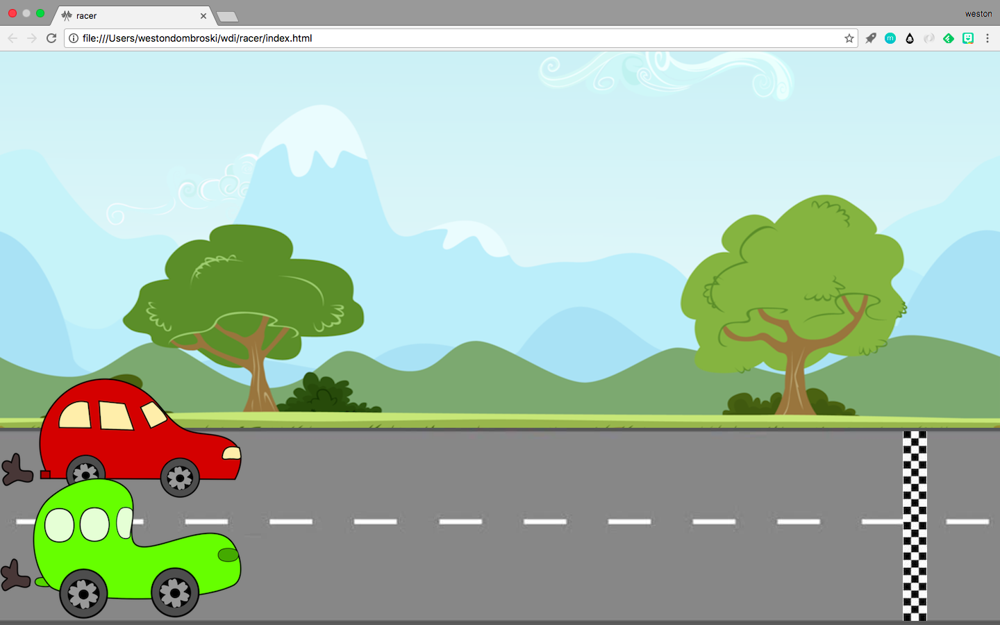

# racer

## Technologies Used

This game was built using html, css and javascript/jquery-3.

## Current Features

Car 1 races using the enter key and Car 2 with the spacebar. A banner of whoever crosses the finish line first will pop up in the middle of the screen (these banners are currently placed behind the scene with a class of "hidden").

## Planned Features

I plan on introducing some sound effects into the mix at some point and hopefully will get the winner banners working in the very near future.

[Vroom Vroom!!] (https://github.com/westondombroski/racer)
